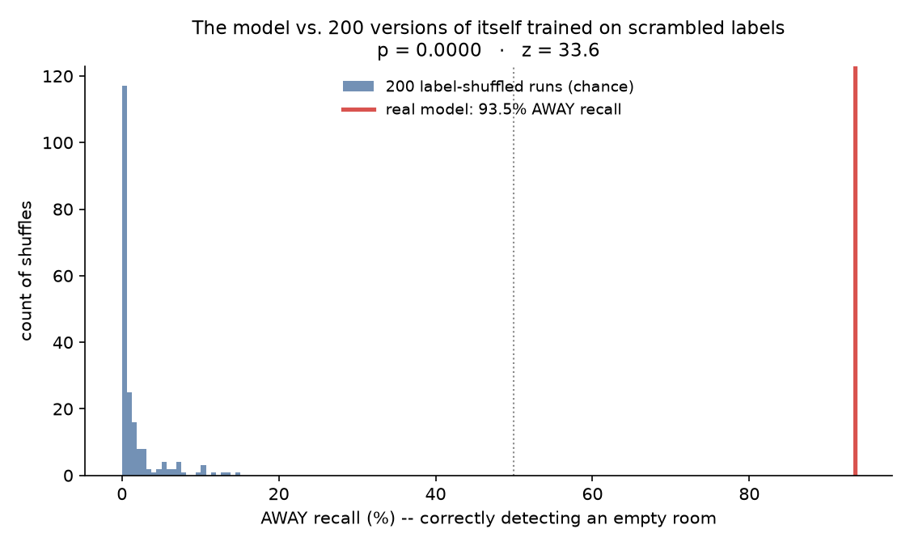
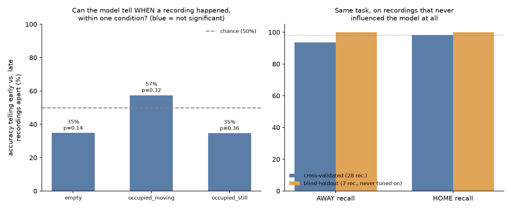

# Proving the model isn't guessing

Three independent checks, each built to survive the specific objection in its
name. Regenerate anytime with:

```bash
.venv/bin/python -m src.prove
```

It reads the exact model in `artifacts/esp32_model.joblib` — nothing here is
re-tuned to make a nicer number — and writes two charts to `artifacts/proof/`.

---

## 1. "Couldn't it just be guessing very accurately?"

**The test:** take the 28 recordings, randomly reassign which ones are labelled
`empty` and which are `occupied` (same counts, just scrambled), and run the
*exact same* evaluation on the scrambled labels. Repeat 200 times. If the real
93.5% AWAY recall is real detection, it should sit far outside what 200 random
scrambles can produce. If it were noise, luck, or overfitting to some quirk of
the recordings, the real score would look like just another draw from that pile.

**Result:** the 200 shuffles average 1.5% AWAY recall (chance — a model with no
real signal defaults to almost always guessing the majority class, which is
`occupied`). The real model's 93.5% is **33.6 standard deviations** above that,
and **beat every single one of the 200 shuffles** (p = 0.0000).



**Say it like this:** *"We shuffled the labels 200 times and re-ran the same
evaluation on each shuffle. Random guessing tops out around 15%. Our model hits
93.5% — that's not in the range chance can reach."*

---

## 2. "Couldn't it be remembering the order things were recorded in?"

**The test:** take only the recordings of *one* condition — say, all 10 `empty`
recordings — and ask the identical pipeline to tell the first half of the
session's recordings apart from the second half. If the model's real skill were
actually "the channel drifts over the hour and I'm reading a clock," this should
be at least as easy as detecting occupancy. Each condition gets its own
permutation-based p-value, because with only ~9-10 recordings per condition a
bare percentage has no error bars attached to it.

**Result:** none of the three conditions are distinguishable from chance
(p = 0.14, 0.32, 0.36) — while the same pipeline tells occupied from empty at
93.5%+ recall. Whatever it's using, it isn't when the recording happened.



**Say it like this:** *"We asked it to tell early recordings from late ones,
within the same condition. It can't — p-values of 0.14 to 0.36, not close to
significant. It can tell occupied from empty at 93%+. So the signal is
occupancy, not session order."*

---

## 3. "Does it actually work on data it's never seen?"

**The test:** set aside 7 of the 28 recordings — stratified across all three
conditions — **before looking at any result**. Train the exact shipped
configuration (scale-free features, quantile baseline, logistic regression,
threshold 0.60 — read straight from the saved model, not re-tuned) on the
remaining 21, and score it once on the 7 it has never been fit or tuned against.

**Result:** 100% accuracy, 100% AWAY recall, 100% HOME recall on the holdout.

**Honest caveat, said out loud in the room:** 7 recordings is a small holdout, so
100% is a small-sample result, not a promise the model is perfect — the
cross-validated number (93.5% / 98.2%, from all 28 recordings, each held out in
turn) is the one to quote as the headline. What this test adds is narrower and
still real: the *exact deployed artifact*, not a variant, generalizes to
recordings that had zero influence on its parameters. Also worth saying plainly:
the winning *configuration* (which features, which model) was chosen using
cross-validation over all 28 recordings, so this is a confirmatory check, not an
independent hyperparameter search.

---

## The fourth proof: do it live

The strongest demo isn't a chart — it's letting the audience watch it happen.
The dashboard's **Replay a recording** panel (or the boards themselves, if
they're in the room) shows the same pipeline scoring real, unlabelled-to-the-
audience packets in real time:

```bash
.venv/bin/python -m uvicorn backend.main:app --host 127.0.0.1 --port 8000
```

Click **Empty room** / **Occupied · still** / **Occupied · moving** and watch
the verdict, confidence, and `p(occupied)` trace update against the tuned
decision line. If the boards are available, better still: have someone from the
audience leave and re-enter the room and watch the dashboard respond to *them*,
live, to a condition that cannot possibly have been memorized because it just
happened.

---

## What NOT to claim

- Not "100% accurate" — the honest number is the cross-validated one (93.5%
  AWAY recall / 98.2% HOME recall over all 28 recordings), not the small-sample
  holdout.
- Not "works in any house" — every number here is calibrated to this specific
  site's own quiet baseline. A new location needs its own `empty` recordings
  before the model means anything there.
- Not "proven over long timescales" — the longest gap tested end-to-end is one
  recording session (~45 minutes). Whether the model still works after the
  boards are bumped, or a week later, is genuinely untested; say so if asked.
